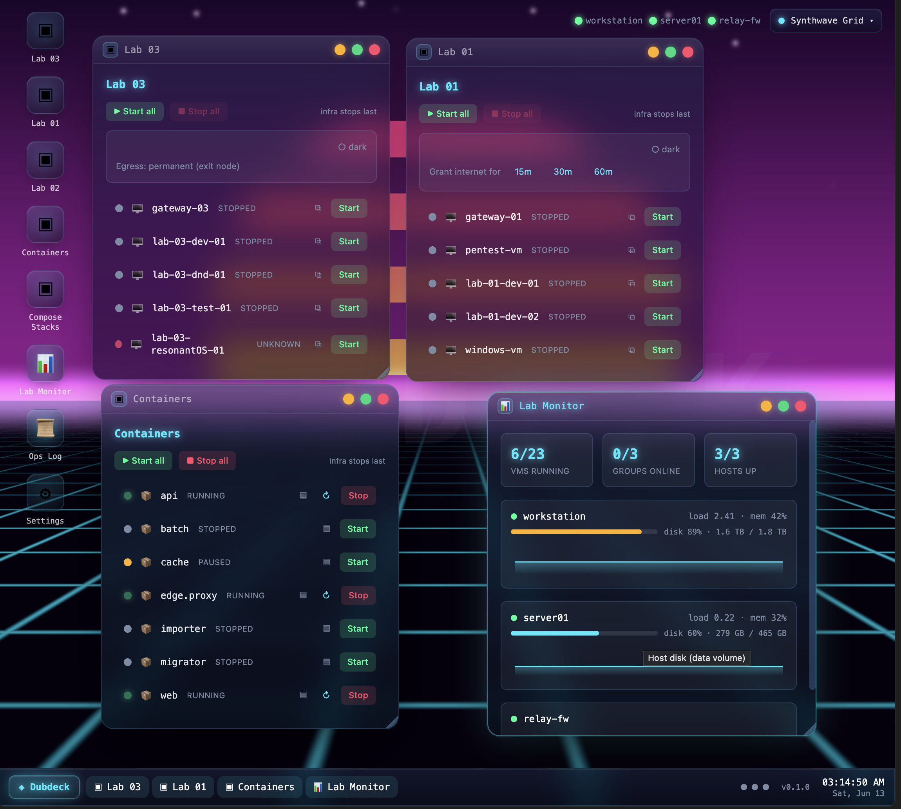

<div align="center">

# 🖥️ Dubdeck

### A desktop-OS-themed web app for controlling virtual lab infra.

Start, stop, snapshot, and route your VMs and containers from one browser tab —
draggable windows, a taskbar, a system tray, and an animated neon wallpaper.
You declare your infrastructure in YAML; Dubdeck drives it all over SSH.

<br />

[](LICENSE)
[](backend/)
[](frontend/)
[](backend/)
[](compose.yaml)
[](CONTRIBUTING.md)

<sub>Built and maintained by <b>Team Dub Labs</b></sub>

</div>

---

> [!WARNING]
> **Alpha — under active development.** APIs, config schema, and UI layout will
> change without notice until a `v1.0` tag is cut.

## Contents

- [What is Dubdeck?](#what-is-dubdeck)
- [Screenshot](#screenshot)
- [Features](#features)
- [Providers](#providers)
- [Quickstart](#quickstart-docker-compose)
- [Configuration](#configuration)
- [Architecture](#architecture)
- [Development](#development)
- [Hardening](#hardening)
- [License](#license)

---

## What is Dubdeck?

Dubdeck is a single-pane control panel for a home or research lab, styled as a miniature
desktop operating system. Instead of remembering which hypervisor, host, and address each
machine lives on, you open one tab and see everything as live, draggable windows.

The core unit is a **group**: a named collection of resources shown as one window, with
bulk start/stop and ordering policies. One common shape is an **enclave** — a gateway VM
plus the machines behind it — but a group can be any set of resources you want to manage
together, VMs or containers, gated or not.

Everything Dubdeck touches it reaches over a **transport** (SSH by default, or local),
behind a provider abstraction. That keeps the whole thing testable: every provider ships
a fake transport with captured command fixtures, so the test suite never opens a real
connection and is CI-safe by construction.

---

## Screenshot

<div align="center">

<!-- To regenerate: run the demo server (see below), open the UI, arrange the
     windows, and save the capture as docs/screenshot.png. -->


<br />

<sub>The desktop above is the bundled <b>demo</b> running against fictional infrastructure — no real hosts.
Reproduce it locally with <code>cd backend &amp;&amp; uv run python demo_server.py</code> (serves on <code>127.0.0.1:8042</code>)
plus <code>npm run dev</code> in <code>frontend/</code>.</sub>

</div>

---

## Features

🪟 **Desktop shell**
Draggable / minimizable / maximizable windows, taskbar with start menu, system tray, live
clock, and an animated neon particle wallpaper.

⚙️ **VM lifecycle**
Start · stop · suspend · resume · force-stop. Snapshot list + create per VM (restore and
delete are intentionally blocked). Optional snapshot-before-stop guardrail per group.

📡 **Live status that never freezes**
A stale-while-revalidate cache means a slow or unreachable host times out independently and
can't block the UI. Server-Sent Events push an instant refresh after every mutation, with
polling as a fallback.

🔀 **Group semantics**
Start a group → the gateway tier comes up first and Dubdeck waits until it's reachable
before touching members. Stop → members first, gateway last; it stays up if any member
refuses to stop. A per-group lock dedupes racing starts.

🔐 **Single-user auth, on by default**
First run walks you through setting a password (argon2id). Sessions, login/logout, and
password change are built in — the loopback bind is defense-in-depth, not the only lock.

🧩 **Optional modules**
Toggle features from the Settings window without editing config. The **egress** module adds
a timed internet exit-node toggle per group, with **server-side auto-revoke** — the window
closes even if the browser tab is gone and the backend restarts mid-session. A missed
revoke raises a pulsing `REVOKE OVERDUE` alarm and retries on a 30s sweep.

📓 **Ops log**
Every action Dubdeck takes is recorded — who, what, when, result — and persisted in SQLite
across container restarts.

🛡️ **Hardened by default**
Binds `127.0.0.1` only. Middleware rejects DNS-rebinding (Host allowlist) and drive-by
cross-site requests to `/api`.

---

## Providers

| Provider | Backend command | Status |
|---|---|:---:|
| KVM / libvirt | `virsh` | ✅ Current |
| Parallels | `prlctl` | ✅ Current |
| Docker | `docker` | 🛣️ Roadmap |
| Docker Compose stacks | `docker compose` | 🛣️ Roadmap |
| Proxmox | Proxmox API | 🛣️ Roadmap |

> Each provider is one instance of a provider *type* bound to a host. Adding hardware is a
> config edit, never a code change.

---

## Quickstart (Docker Compose)

**Prerequisites:** Docker with Compose · an SSH keypair the backend can use · target hosts
reachable from the machine running Dubdeck.

```bash
# 1. Copy the example config and edit it for your hosts
cp config.example.yaml config.yaml
$EDITOR config.yaml

# 2. Put the SSH key and a pinned known_hosts under secrets/
mkdir -p secrets
cp ~/.ssh/id_ed25519 secrets/ssh_key          # or generate a dedicated key
ssh-keyscan 192.0.2.10 >> secrets/known_hosts # add each host

# 3. Build and start
docker compose up -d --build

# 4. Open the UI and complete first-run setup (set your password)
open http://127.0.0.1:8400
```

The default published port is **`127.0.0.1:8400`** (loopback-only). Change the left side of
the `ports:` mapping in `compose.yaml` for a different port.

> [!CAUTION]
> Don't expose this port to the network without understanding the trade-offs. Auth is on by
> default, but the app is built assuming a trusted loopback. See `DUBDECK_ALLOWED_HOSTS` in
> `compose.yaml` and the [hardening](#hardening) notes.

<details>
<summary><b>Docker Desktop for Mac:</b> keep the mounted SSH key readable</summary>

<br />

Pass your UID so the key's owner matches inside the container:

```bash
docker compose build --build-arg PUID=$(id -u) && docker compose up -d
```

</details>

---

## Configuration

[`config.example.yaml`](config.example.yaml) is the annotated reference. Copy it to
`config.yaml` — this is your live infrastructure **inventory** (hosts, providers, groups),
declarative data rather than app settings. Module toggles, auth, and branding live in the
Settings window, not here.

```yaml
hosts:
  linux01:
    transport: ssh
    address: 192.0.2.10   # IP or tailnet IP the backend can reach
    user: labuser
    stats: linux          # host load/mem/disk source: linux | macos | null

providers:
  - id: lab-kvm
    type: libvirt         # libvirt | parallels  (docker/proxmox: roadmap)
    host: linux01

groups:
  research:
    label: "Research Lab"
    members: [lab-kvm/research-fw, lab-kvm/research-a, lab-kvm/research-b]
    policies:
      start_first: [lab-kvm/research-fw]               # gateway tier: up first, down last
      ready_probe: { ref: lab-kvm/research-fw }         # wait for RUNNING before the rest
      snapshot_before_stop: true                        # recoverable stops
```

> [!IMPORTANT]
> **Secrets never go in `config.yaml`.** The SSH private key and a pinned `known_hosts` are
> mounted read-only via `compose.yaml`; the config only names the user to connect as.
> Use stable IPs (or a VPN/tailnet IP) over hostnames local DNS might shadow.

An `auto:` group tracks a provider's full live resource list instead of a hand-written
member list — essential for churn-heavy providers like Docker.

---

## Architecture

<details open>
<summary><b>Everything runs over a transport abstraction</b></summary>

The backend never calls hypervisor binaries directly — it sends commands through a
`Transport` (`SSHTransport`, `LocalTransport`, or `FakeTransport` in tests). Parsers are
pure functions over captured command output, so providers are testable in isolation with no
network calls.

</details>

<details>
<summary><b>One cached status snapshot</b></summary>

`GET /api/status` reads an in-memory snapshot rebuilt in the background on a fixed interval.
A slow or unreachable host times out independently and can't block the rest of the poll.
Mutations push a fresh snapshot over SSE the moment they complete.

</details>

<details>
<summary><b>Group lifecycle</b></summary>

Starting a group starts the gateway tier (`start_first`) and waits for `ready_probe` to
report RUNNING before touching members. Stopping stops members first; the gateway stays up
if any member refuses. A per-group lock prevents racing starts from duplicating work.

</details>

<details>
<summary><b>Server-authoritative egress engine</b></summary>

The egress timer lives on the server. An expiry row in SQLite survives backend restarts; on
startup the backend reconciles by reading each gateway's actual exit-node state and
re-queuing orphaned windows. A 30-second sweep retries transient revoke failures. The
browser tab does not need to stay open.

</details>

---

## Development

See [`CONTRIBUTING.md`](CONTRIBUTING.md) for the full guide. The quality gate is
[`scripts/check.sh`](scripts/) — run it before every push.

```bash
# Backend — FastAPI + uv
cd backend
uv run fastapi dev app/main.py                       # dev server on :8000, hot-reload
uv run pytest                                         # full suite, no real SSH, CI-safe
uv run ruff check --fix . && uv run ruff format .     # lint + format

# Frontend — React + Vite
cd frontend
npm install
npm run dev                                           # :5173, proxies /api to :8000
```

<details>
<summary><b>Project layout</b></summary>

```
dubdeck/
  config.example.yaml     — infrastructure inventory template
  compose.yaml            — production Docker Compose stack
  Dockerfile              — multi-stage: node frontend build → python backend
  backend/
    app/
      main.py             — FastAPI app + routers
      sshlayer.py         — Transport protocol + SSH impl + FakeTransport
      hypervisors.py      — prlctl / virsh command builders + pure-function parsers
      egress.py           — egress engine: set / revoke / reconcile / retry sweep
      status.py           — stale-while-revalidate status cache
      opslog.py           — SQLite ops log
    tests/                — pytest; FakeTransport in every test
  frontend/
    src/
      shell/              — Desktop, Window, Taskbar, StartMenu, Tray, Clock, Wallpaper
      apps/               — group windows, Lab Monitor, Ops Log, Settings
      api.ts              — typed API client
  docs/
    OSS-REFACTOR-PLAN.md  — the public → v1.0 roadmap
    pro-tips/             — optional hardening guides
```

</details>

---

## Hardening

The optional Mac + Parallels loopback-sshd setup — forced-command shim, key command
allowlisting, `ListenAddress 127.0.0.1` — lets Docker-on-Mac reach the host's hypervisor
without opening the SSH daemon to the network, and limits what a compromised container key
could run on the host.

→ [`docs/pro-tips/mac-parallels-hardening/`](docs/pro-tips/mac-parallels-hardening/)

---

## License

[MIT](LICENSE) — Dubdeck is built and maintained by **Team Dub Labs**.

<div align="center"><sub>Made for people who run more lab than they can remember.</sub></div>
